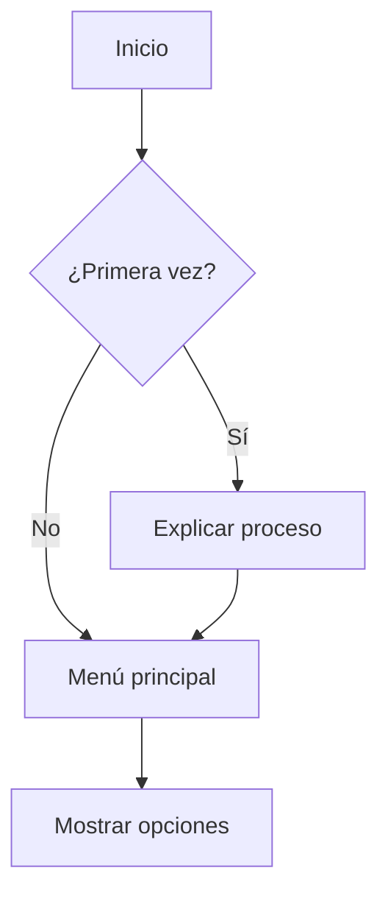

# Flujos de Conversación

## 1. Bienvenida e Inicio

## 2. Proceso de Postulación
### Flujo Principal
1. Bienvenida
2. Solicitud de información básica
   - Nombre completo
   - Correo electrónico
   - Teléfono
3. Solicitud de CV
4. Preguntas de filtro inicial
5. Confirmación y siguiente pasos

### Preguntas de Filtro
- Experiencia relevante
- Disponibilidad
- Expectativas salariales
- Ubicación/Modalidad preferida

## 3. Seguimiento de Postulación
- Consulta de estado
- Actualización de información
- Programación de entrevistas

## 4. Mensajes Automatizados
### Templates
1. Confirmación de recepción
2. Solicitud de información adicional
3. Programación de entrevista
4. Actualización de estado
5. Feedback inicial

## 5. Flujos de Error
### Manejo de Situaciones
- CV en formato no soportado
- Información incompleta
- Timeout en respuestas
- Problemas técnicos
