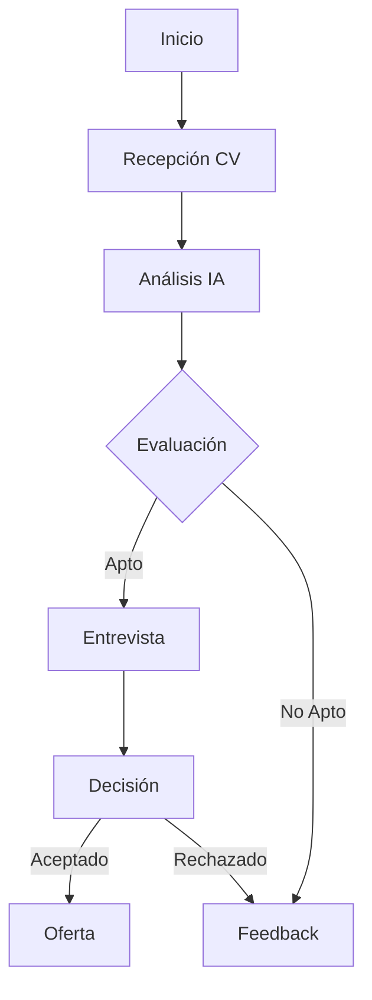

# Proceso de Reclutamiento

## Flujo Principal

## Etapas del Proceso

### 1. Recepción de CV
- Canal: WhatsApp
- Formato: PDF
- Validaciones iniciales
- Confirmación automática

### 2. Análisis IA
- Extracción de información
- Match con requisitos
- Evaluación de experiencia
- Generación de resumen

### 3. Evaluación
- Criterios configurables
- Scoring automático
- Flags importantes
- Recomendaciones

### 4. Entrevista
- Agendamiento automático
- Preguntas sugeridas
- Registro de feedback
- Evaluación estructurada

### 5. Decisión
- Criterios objetivos
- Matriz de evaluación
- Aprobaciones requeridas
- Documentación

### 6. Feedback
- Mensajes personalizados
- Recomendaciones
- Siguientes pasos
- Oportunidades futuras

## Estados del Proceso

1. **Inicial**
   - CV recibido
   - En análisis

2. **Evaluación**
   - Analizado
   - En revisión
   - Evaluado

3. **Entrevista**
   - Agendada
   - Realizada
   - Pendiente feedback

4. **Final**
   - Aceptado
   - Rechazado
   - En oferta
   - Contratado

## Integraciones

### WhatsApp
- Recepción de documentos
- Comunicación automática
- Seguimiento de estado
- Feedback instantáneo

### IA
- Análisis de CV
- Evaluación objetiva
- Recomendaciones
- Generación de feedback

### Sistema Core
- Gestión de procesos
- Almacenamiento de datos
- Workflow automation
- Reportes y métricas

## Métricas

1. **Eficiencia**
   - Tiempo de procesamiento
   - Tasa de conversión
   - Precisión de IA
   - Satisfacción candidatos

2. **Calidad**
   - Accuracy de evaluaciones
   - Tasa de aceptación
   - Feedback positivo
   - Retención post-hire

## Consideraciones

### Privacidad
- Consentimiento explícito
- Manejo de datos sensibles
- Retención limitada
- Acceso controlado

### Escalabilidad
- Procesamiento paralelo
- Colas de mensajes
- Cache distribuido
- Load balancing

### Mantenibilidad
- Logs detallados
- Monitoreo continuo
- Testing automatizado
- Documentación actualizada
